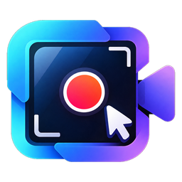
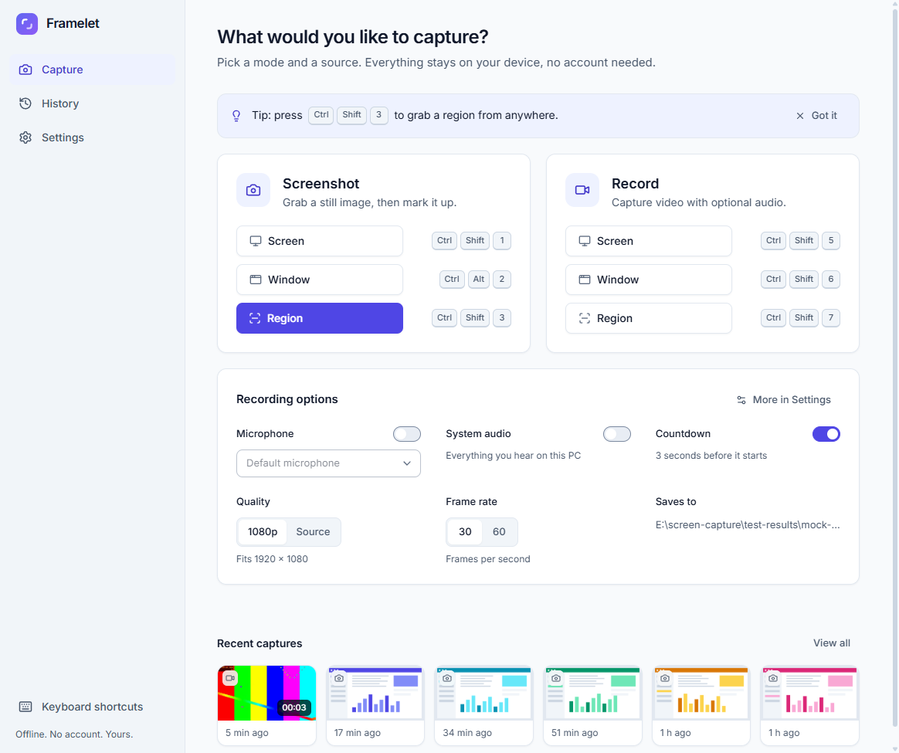
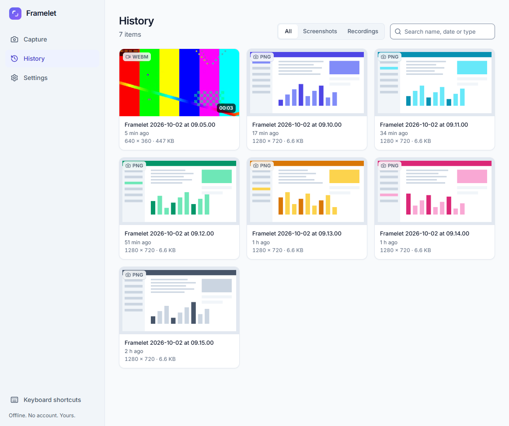
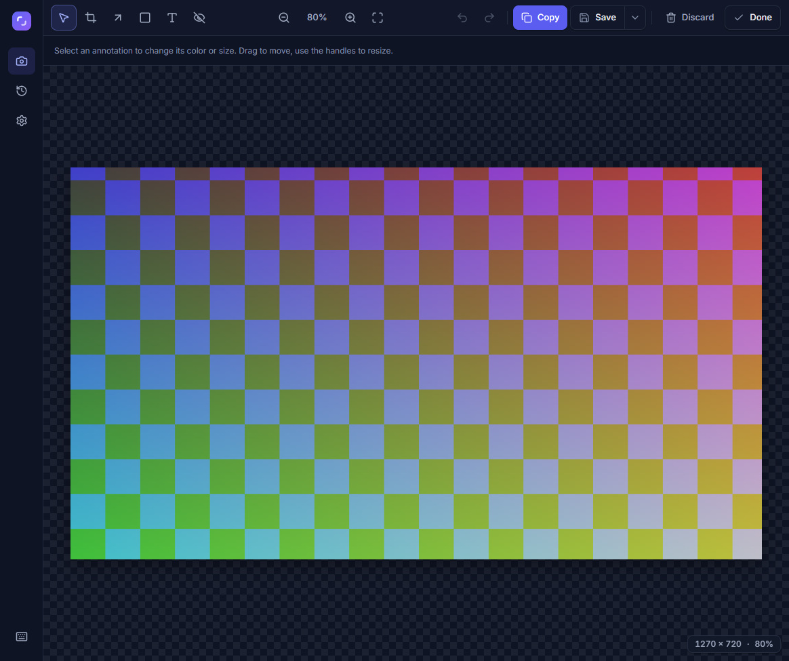

<p align="center"></p>

# FrameCapt

> **FrameCapt is a provisional product name.** It has not been checked for trademark conflicts (see [docs/OWNER-TASKS.md](docs/OWNER-TASKS.md)).

FrameCapt is a screenshot and screen-recording app for Windows, made for developers, QA engineers, freelancers and support teams. Press a shortcut, pick a screen, window or region, capture or record, mark it up if you want, then copy or save. **Captures never leave your computer: there is no cloud storage, no upload and no sharing links.** Using the desktop app now requires signing in with a FrameCapt account (personal, or as a member of an organization); after one online sign-in it keeps working offline for a limited time. There is no telemetry. It is free software under the GNU GPL version 3.

This repository holds the Electron desktop app only. The earlier account, organization and website work is preserved on the branch `login-website`.

**Status: beta (version 0.1.0, unreleased).** Everything below was built and exercised on one Windows 11 machine; see [Project status](#project-status) for what that does and does not cover.

## Features

Implemented and verified on the development machine (details and evidence in [docs/capability-matrix.md](docs/capability-matrix.md)):

- **Screenshots** of a screen, a window or a rectangular region (one monitor per region), saved as PNG or JPEG or copied to the clipboard.
- **Editor**: crop, arrow, rectangle, text, **solid opaque redaction**, undo/redo. Redactions are flattened into the exported pixels, the clipboard image and the history thumbnail.
- **Screen recording** of a screen, a window or a region: 1080p or source resolution, 30 or 60 fps, optional microphone and Windows system audio mixed into one track, pause/resume/stop, floating toolbar with a timer, optional 3-2-1 countdown. The toolbar and selection overlays are not part of the recording.
- **Crash-tolerant recording**: video is written to disk while recording (bounded memory), finished into a seekable WebM file, and an unfinished recording found at the next start can be recovered on a best-effort basis (see [docs/recording-persistence.md](docs/recording-persistence.md); recovery is not lossless).
- **MP4 export** (H.264 + AAC) with progress and cancel, using a bundled FFmpeg.
- **Local history** of your captures with search, thumbnails, "file moved" handling and delete-to-Recycle-Bin.
- **Command center** (Ctrl+K) and command palette in a custom title bar, multi-select and bulk actions in the Library, customizable shortcuts for the editor and global actions.
- Settings, **global shortcuts** (configurable), tray icon, close-to-tray, light/dark theme following Windows, keyboard-accessible UI.

Not implemented: cloud storage or sharing of captures, accounts, OCR, AI features, webcam overlay, a video timeline editor, a mobile app, macOS builds (Linux builds are experimental).

Pending or unverified: code signing (the installer is **unsigned**), automatic updates (disabled until an update source exists), Windows 10 and non-x64 testing, screen-reader testing, mixed-DPI/rotated/negative-origin monitor layouts on real hardware.

## Repository layout

```text
apps/
  desktop/    Electron app (capture, editor, recording, local history)
docs/         Documentation
```

Details: [docs/repository-layout.md](docs/repository-layout.md).

## Screenshots

These images are taken from the automated test build with synthetic content (no real desktop content). (The home screenshot comes from a test run in which the window-screenshot shortcut had been changed to `Ctrl+Alt+2`; the defaults are in the table below.)

| Home (light)                                        | History (light)                                                   |
| --------------------------------------------------- | ----------------------------------------------------------------- |
|     |             |
| **Editor (dark)**                                   | **Recording toolbar**                                             |
|  |  |

## System requirements

- Windows 10 or later, 64-bit (x64). Only Windows 11 was available for testing; Windows 10 is expected to work but is **not verified**. Windows on ARM is not targeted.
- Disk space: the installer is about 229 MB (it contains FFmpeg). Recording refuses to start below 1 GB free on the drive that holds the app data.
- Microphone and system-audio capture use what Windows provides; nothing else is required.

## Install

There is no public release yet. Two ways to get a build:

1. **From source** (see [Build from source](#build-from-source)); `npm run make` produces `FrameCapt-Setup-0.1.0.exe` and a portable zip under `apps/desktop/out/make/`.
2. **The installer.** `FrameCapt-Setup-0.1.0.exe` is a per-user Squirrel installer (no administrator rights; installs to `%LOCALAPPDATA%\FrameCapt`). **The installer is UNSIGNED: no code-signing certificate exists yet, so Windows SmartScreen will warn when you run it** and you will have to choose "More info" and "Run anyway". Verify the SHA-256 shown on the release page before running it. Uninstalling keeps your settings, history and captures.

## Linux (experimental)

An experimental Linux x64 build (`.deb` for Ubuntu/Debian and an AppImage) exists, built with `npm run make` on Linux ([docs/building-on-linux.md](docs/building-on-linux.md)). It is **not released, unsigned and was only tested in WSL2 (WSLg) and on a virtual X server**, never on a real Linux desktop. Limitations: it runs on X11 (through XWayland on Wayland sessions; native Wayland windows may be missing or black, and under WSLg the captured pixels are black); **no system audio** (microphone only); the recording toolbar may appear in full-screen recordings; global shortcuts, tray and microphone are unverified on a real desktop. Details: [docs/capability-matrix.md](docs/capability-matrix.md).

## Quick start

| Do this                       | Default shortcut |
| ----------------------------- | ---------------- |
| Screenshot: screen            | `Ctrl+Shift+1`   |
| Screenshot: window            | `Ctrl+Shift+2`   |
| Screenshot: region            | `Ctrl+Shift+3`   |
| Record: screen                | `Ctrl+Shift+5`   |
| Record: window                | `Ctrl+Shift+6`   |
| Record: region                | `Ctrl+Shift+7`   |
| Stop recording                | `Ctrl+Shift+0`   |
| Pause or resume the recording | `Ctrl+Shift+9`   |

Shortcuts work from any app while FrameCapt runs (also in the tray) and can be changed in Settings. You can also click the same actions on the home screen. Screenshots open in the editor; recordings land in `Videos\FrameCapt`, screenshots you save go to `Pictures\FrameCapt` by default. See the [user guide](docs/user-guide.md) and [keyboard shortcuts](docs/keyboard-shortcuts.md).

## Privacy

Captures, history and recordings stay on your computer; nothing is uploaded and there is no telemetry or analytics. The app makes no network requests of its own and blocks them from its windows (measured: [docs/packaging.md](docs/packaging.md#network-behavior)); there is no account service. Details of what is stored on your PC: [PRIVACY.md](PRIVACY.md).

## Build from source

Prerequisites: Windows, Node.js 24, npm, git. FFmpeg is downloaded (and SHA-256 checked) by a script.

```
npm ci
npm start          # desktop development run (fetches FFmpeg first)
npm run make       # installer + portable zip in apps/desktop/out/make/
```

Full instructions: [docs/building-on-windows.md](docs/building-on-windows.md).

## Tests and verification

The root scripts run the desktop workspace. Automatic CI only builds the Windows and Linux desktop packages and uploads them; **tests run locally** ([docs/testing.md](docs/testing.md)).

```
npm run lint && npm run typecheck && npm test      # desktop
npm run test:e2e         # desktop UI tests with a synthetic capture source
npm run test:native      # real capture on an interactive desktop (local only)
npm run bench:recording  # 30-minute recording benchmark (local only)
```

Other check: `npm run check:mocks` (no mock or test-hook code in a normal build).

## Project status

The desktop app is implemented and was verified locally on one Windows 11 machine. Not done or not verified: a signed installer; Linux tray behavior on a real desktop; any release publication. Remaining owner inputs are in [docs/OWNER-TASKS.md](docs/OWNER-TASKS.md).

The original desktop build phases 01 to 10 were done and verified on one machine (Windows 11 Pro, AMD Ryzen 7 7700, two monitors): real screen/window/region capture, system audio, 30-minute 1080p30 recording (29.72 fps average), forced-kill recovery, MP4 export, a silent install and uninstall of the unsigned installer. The numbers and their limits are in [docs/performance.md](docs/performance.md) and [docs/agent-progress.md](docs/agent-progress.md). Not tested: Windows 10, ARM, a signed build, SmartScreen behavior, power loss during recording, real disk-full.

## License

FrameCapt is licensed under the **GNU General Public License v3.0 only** ([LICENSE](LICENSE)). The desktop app bundles FFmpeg (GPL-3.0-or-later build), Electron/Chromium and a number of MIT/ISC/OFL components: see [THIRD_PARTY_NOTICES.md](THIRD_PARTY_NOTICES.md). Whoever distributes a binary build must also provide the corresponding source, including that of FFmpeg.

## Documentation

- [User guide](docs/user-guide.md), [keyboard shortcuts](docs/keyboard-shortcuts.md)
- [Building on Windows](docs/building-on-windows.md), [testing](docs/testing.md), [packaging](docs/packaging.md), [release process](docs/release-process.md)
- [Architecture](docs/architecture.md), [decisions](docs/decisions.md), [capability matrix](docs/capability-matrix.md), [security review](docs/security-review.md), [performance](docs/performance.md), [recording persistence](docs/recording-persistence.md), [FFmpeg](docs/ffmpeg.md)
- [Privacy](PRIVACY.md), [security policy](SECURITY.md), [contributing](CONTRIBUTING.md), [changelog](CHANGELOG.md), [owner tasks](docs/OWNER-TASKS.md)
